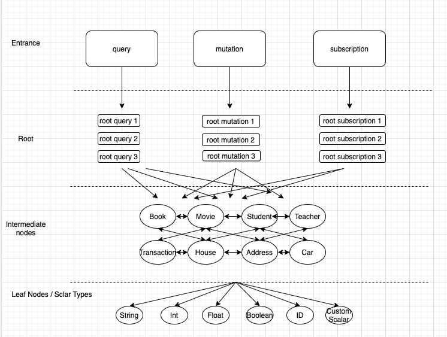

# Graphql Tutorial

## Overview

First of all, this tutorial is based on my own experiences with graphql. Things may go wrong, always open for discussion.

In general, Graphql replaces JSON-response REST APIs. So:

-   If it is not an API, like an server side rendered HTML page => Not Graphql
-   If you want some non-JSON response, like images, videos, binary data => Not Graphql

A really abstract way of thinking Graphql is: **Graphql is a REST endpoint handler, sits on one REST endpoint. It is kind of like a SQL server accept SQL queries (select/update/delete... in Graphql grammar) in POST request, and return all responses in JSON.**

_Just to be clear, it is not DB. I don't want to confuse you by mentioning SQL_

## REST operations vs Graphql operations

### REST

#### GET

-   Send data with query strings

    -   ?a=xxx&b=xxx&c=xxx

#### POST/PUT/DELETE

-   Send data with request body
    -   plain text
    -   form data
    -   xml
    -   JSON
    -   almost anything...

All operations supports almost all kinds of response formats..

### Graphql

Assume Graphql handler running on `/graphql` endpoint

#### query

-   readonly operations, like GET

POST http://www.yourserver.com/graphql

with a JSON body:

```
{
    "query": "query {...}"
}
```

#### mutation

-   operations that can mutate server data, like POST/PUT/DELETE

POST http://www.yourserver.com/graphql

with a JSON body:

```
{
    "query": "mutation {...}" // the key is still "query"
}
```

#### subscription

-   think this as registering event listener to server, mostly done though sockets.
    -   [Subscription with Apollo Server](https://www.apollographql.com/docs/apollo-server/data/subscriptions/)
    -   [Subscription with Apollo Client](https://www.apollographql.com/docs/react/data/subscriptions/)

## Benefits of Graphql

(Which is also the issues with REST if you don't keep your code extremely clean. I really mean extremely)

### Typed and uniformed response data

This is kind of the difference between loose typing vs strong typing languages.
Where REST is the loose typing, even if it is in JSON format, but your actual "shape" of data is not pre-defined, and you have to see the result to know what exactly it is.

For example, you may have multiple REST APIs that response same data type,

-   Get Product by id, response one Product
-   Search Products, response an array of Product
-   Get Vendor by id, response a Vendor with list of Product for the vendor

While developing, you may change the "shape" of Product in one API, and forget to update the others. Without help of tools, it is really hard for you know to remember where all the places that use Product, so this is really a common thing when working with REST. Now when working on the client side, you have two problems:

-   For the APIs got updated, you have to update the client side code. But you don't have a "hard way" to check where exactly the client side code has to update, unless you have full integration tests.
    -   Well, you still need to update codes if using Graphql, but Graphql comes with tools to tell you exactly which requests need to update.
-   You have inconsistent data "shape" of same logical data type.
    -   Someone who used "Search Product" before may expect you to return same data "shape" for "Get Product by id"

### Response exactly what you need

Typically it is the backend developers decide exact "shape" to be responded from sever. But

-   Some of the values are not really used in some cases, and they become "redundant".
-   Some of the values, like one-to-many lookups, or requires expensive computations.

In REST, of course you can do a "includeXXX" for each of the possible key to be return. But congratulations, you just re-created Graphql. This Graphql feature is kind of like "select a,b,c" in SQL.

### Pick between "request round-trips" vs "server side work"

When designing REST APIs, you usually design endpoints in two ways, but each have its own downside:

#### By resource

Server only have endpoints like:

-   Get /product
-   Get /products
-   Get /vendor
-   Get /vendors

When you have views that need multiple resources from server side, you need to do multiple requests.

#### By view

Endpoints kind of like one-to-one mapped to views:

-   Get /home
-   Get /myProfile
-   Get /myOrders

Its works, but now whenever your client UI needs update, change the resources needed, you have to work on server side again.

Think what if you have a master endpoint that takes parameter like "/product + /vendor" and look up resources from those endpoints and return to you. This will solve the problem of both sides. Well, this what Graphql does.

### Client side caching

TODO

## Graphql families

There are two main families of graphql:

-   Relay
-   Apollo

Apollo is the easier one to work with. https://www.apollographql.com/

All remaining of this doc will be based on Apollo Graphql, it may or may be the same if you use Relay Graphql

## Work with Graphql Server

When talking about a "Graphql Server", it can be:

-   a REST server that has only one graphql handler on one endpoint
-   a REST server that has multiple graphql handlers on different endpoints
-   a REST server that has one more graphql handler(s) and normal REST endpoints/handlers

When you are introduced to a running Graphql server, the first thing you should do I to find the data schema, which can be done in two ways:

-   Read though schema definition files if you have access to the code base
-   Use Graphql IDEs like:
    -   Graphql Playground
    -   Graphiql
    -   [Postman](https://www.postman.com/graphql/), (yes, it supports Graphql now)

Usually Graphql server will host one in-browser IDE in dev environment.

For example, if you spin up my [sample graphql server](https://github.com/kdong007/sample-graphql), you can open up http://localhost:4000/ and see a Graphql Playground.
Click on "DOCS" or "SCHEMA" to the right to view the schema definitions.

## Understand the nodes

Take quick tour of [Graphql official introduction](https://graphql.org/learn/) first

In Graphql world, we usually define things based on resources, and resources are "linked". Some people say it's "graph", some people say it's more like "tree". I personally think the relationships are like "multi rooted tree with cycles in intermediate nodes".

Here is an illustration of flows on querying or designing your schema:



First, you start with one of three type of operations,

-   query
-   mutation
-   subscription

Then you go into the root operations of each type. For example, here is how "query" is defined in sample project:

```
type Query {
    searchStudents(keyword: String): [Student!]!
    student(id: ID!): Student

    searchCourses(keyword: String): [Course!]!
    course(id: ID!): Course
}
```

_Think this part like REST endpoints_

After "root operations", you move down to the intermediate node, which are resources on your server side that are all chained up. Eventually all of your path have to move down to the leaf nodes, the "scalar types".

Note only the "intermediate nodes" are bi-directional and that's the only "graphql" part.

## Write Graphql operations

TODO

## Design schema

TODO

## Graphql Client / Apollo Client

TODO

## Schema Versioning

TODO

## Analytics / [Apollo-Studio](https://studio.apollographql.com/)

_Apollo-Studio was called Apollo-Engine before_

TODO
